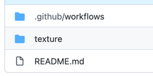
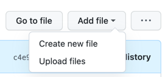
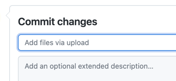
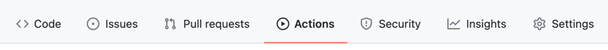
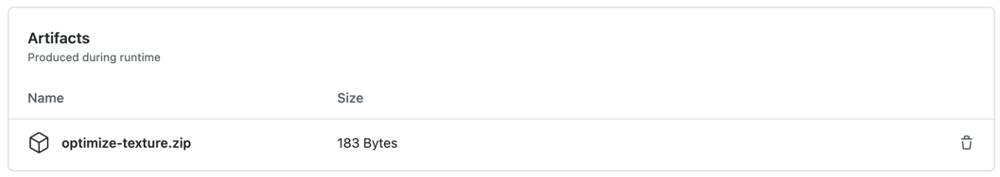
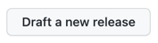
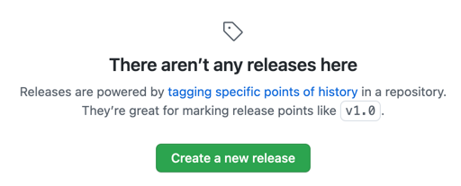
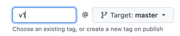
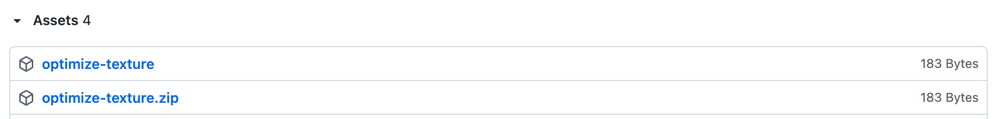

# action-PackSquash

## Usage

### Add Resource Pack File

1. Open `texture`.
   > 
2. Click `Add file`.
   > 
3. Select `Upload files`.
4. Choose your files.
5. Replace `Add files via uploaded` with a description of your changes.
   > 
6. Click `Commit changes`.
   > 

### Download Optimized Resource Pack

1. Click `Actions`.
   > 
2. Select **latest** workflows runs.
3. Click `optimize-texture.zip` under Artifacts.
   > 
4. Unzip the downloaded file.

### Release New Version

1. Click `Releases`.
   > 
2. Click `Draft a new release` or `Create a new release`.
   > 
   > 
3. Enter `Tag version` like `v1`, `v2`, etc.
   > 
4. Click `Publish release`.
   > 
5. After a short wait, it will be available for download from the release.
   > 
